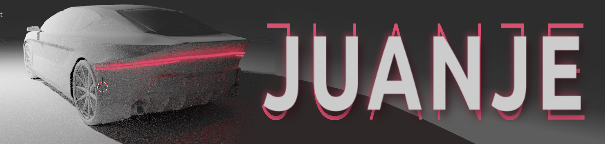

# CV

## Juan Jesús de Pedro Guillo
### Ingeniero de diseño industrial y desarrollo de producto 
### Master en Diseño de automoción y vehículos de competición
#### Quality Assurance - Catia V5 Specialist

https://www.linkedin.com/in/juanjesusdepedroguillo

### Experiencia
SCALIAN:  2022 - Actualidad 
- AMADEUS. Quality Assurance Lead en un proyecto de migración 
de datos y la plataforma que los proecesa (2023-2024).
- ALSTOM y BOMBARDIER. Ingeniero de validación de la calidad
y funcionamiento de enclavamientos ferroviarios (2022-2023).

MyEvent4You: 2020 - 2024 (Ocasional)
- Monitor de Ocio y tiempo libre
- Coordinador de eventos
- Atención al cliente
- Montador y cronometrador de Carreras 
- Logística

Parroquia Nuestra Señora del Rosario: 2020 - Actualidad (Ocasional)
- Monitor de Ocio y tiempo libre
- Diseñador gráfico
- Preparación de campamentos

ICUMPARI: 2018 - 2020
- Conductor / Repatidor
- Atención al cliente y gestión de pedidos
- Gestión del stock del almacén

### SKILLS
PROGRAMAS DE CAD:
- AutoCad
- Inventor
- Catia V5
- Alias
- Siemens NX
- Blender
- FreeCad

SUITES DE OFIMÄTICA:
- Microsoft 365
- LibreOffice
- WPS

DISEÑO GRÁFICO:
- Photoshop
- Illustrator
- Gimp
- Inkscape
- Premiere
- KdenLive

FOTOGRAMETRÍA:
- MetaShape

BOCETADO Y PROTOTIPADO:
- Autodesk Sketchbook
- Krita
- Affinity Designer

IMPRESIÓN 3D: 
- Cura
- AnyCubic

OPTIMIZACIÓN TOPOLÓGICA:
- Altair

CÁLCULO DE RESISTENCIAS:
- OptiStruct

CFD:
- OpenFoam

PROGRAMACIÓN:
- Bash
- SQL
- Python
- JavaScript
-  MarkDown

AGILE:
- SAFE
- SCRUM
- Jira
- Confluence

### CARNETS
- Carnet de conducir B
- Piloto de UAS (Drones) A1/A3 Categoría abierta (EASA)
- Socorrista
- DEA/DESA
- Manipulador de alimentos
- Monito de ocio y tiempo libre

### IDIOMAS
- Español (Nativo)
- Inglés B2
- Francés (Nivel Bajo)